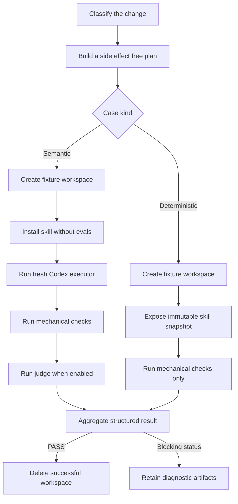

# Evaluating Codex Skills

Skill evaluations, or evals, test what a fresh Codex agent actually does and what deterministic code can prove. They complement structural validation: `quick_validate.py` can show that a skill is well formed, while an eval can show that the skill selects the right workflow, changes the right files, preserves protected behavior, and stops at the right safety gate.

This repository provides an evaluation runner in [`develop-skill-with-evals`](develop-skill-with-evals/scripts/run_skill_evals.py). The detailed automation rules live in the [evaluation contract](develop-skill-with-evals/references/eval-contract.md). Plans follow the [plan schema](develop-skill-with-evals/references/eval-plan.schema.json), and executed reports follow the [result schema](develop-skill-with-evals/references/eval-result.schema.json).

If you want commands and prompts ready to copy rather than runner internals, start with [Using Skills with Codex CLI](CODEX_CLI.md).

## Contents

- [Mental model](#mental-model)
- [Requirements](#requirements)
- [Suite structure](#suite-structure)
- [Choose gates by impact](#choose-gates-by-impact)
- [Plan model session usage](#plan-model-session-usage)
- [What happens during a run](#what-happens-during-a-run)
- [Result statuses, progress, and artifacts](#result-statuses-progress-and-artifacts)
- [Command reference](#command-reference)
- [Optional runtime controls](#optional-runtime-controls)
- [Example: evaluating `refactor-design`](#example-evaluating-refactor-design)
- [Adding evals to another skill](#adding-evals-to-another-skill)
- [Trigger evaluations](#trigger-evaluations)
- [Troubleshooting](#troubleshooting)
- [Design principles](#design-principles)
- [Structural validation](#structural-validation)

## Mental model

An evaluation starts with a **skill change** and asks two questions:

1. What evidence can observe this change?
2. How much evaluation work is proportional to its impact?

The baseline is the skill before the change. The candidate is the proposed skill after the change. A trustworthy behavioral eval fails against the baseline and passes against the candidate. A purely mechanical change uses deterministic evidence instead of spending model sessions on semantic cases that cannot observe it.

The system has five main actors:

- **Planner:** selects gates from the declared impact and cases, then calculates executions and model sessions before anything runs.
- **Evaluated skill:** the baseline or candidate `SKILL.md` and its normal resources.
- **Executor:** a fresh, ephemeral Codex session that receives a realistic task and may edit an isolated fixture.
- **Mechanical checker:** deterministic code that checks commands, files, changed paths, exit codes, and skill integrity.
- **Judge:** a separate Codex session that compares executor evidence with semantic criteria hidden from the executor.

There are two execution paths:



A semantic case needs agent judgment because code alone cannot observe the complete outcome. A deterministic case needs no executor or judge because direct checks cover the complete contract.

The executor never receives `case.json`, judge criteria, or other answer key material. The evaluated skill is installed without its `evals/` directory, so the executor cannot discover the oracle through the repository scoped installation.

## Requirements

- Python 3.10 or newer;
- Git for workspace snapshots and `git:<revision>` sources;
- an installed and authenticated `codex` CLI for semantic cases;
- an environment where nested `codex exec` processes can access their normal state and write to the disposable workspace.

Run the commands below from the repository root, `/home/renanfranca/.codex/skills`, unless a command says otherwise.

`plan` and deterministic cases invoke no model. Semantic cases invoke one executor session and may invoke one judge session, so they consume time and model usage.

## Suite structure

`evals/` is a convention of this repository, not part of the official skill format. It stays outside `references/` so ordinary skill use does not load fixtures or oracles into context.

```text
example-skill/
├── SKILL.md
├── agents/
│   └── openai.yaml
└── evals/
    ├── suite.json
    └── cases/
        ├── semantic-example/
        │   ├── case.json
        │   ├── prompt.md
        │   └── fixture/
        │       ├── source-file
        │       └── test-file
        └── deterministic-example/
            ├── case.json
            └── fixture/
                └── check_behavior.py
```

### `suite.json`

The suite declares its format version and ordered case IDs:

```json
{
  "version": 1,
  "cases": ["semantic-example", "deterministic-example"]
}
```

Each ID must have a matching directory under `evals/cases/`. `run --all` executes cases in this order. The order also determines the remaining regression cases in a cross cutting validation.

### `case.json`

A case combines runner configuration with the expected contract. `kind` selects one of two contracts:

- `behavioral`, `non_behavioral`, and `trigger` are semantic kinds. When `kind` is omitted, `behavioral` remains the compatible default.
- `deterministic` runs mechanical checks without an executor or judge.

The most common fields are:

| Field | Meaning |
| --- | --- |
| `id` | Must equal the case directory name. |
| `kind` | Records the case intent and selects the deterministic contract when set to `deterministic`. |
| `prompt_file` | Semantic prompt filename relative to the case directory; defaults to `prompt.md`. |
| `implicit_skill` | For semantic cases, omits the explicit `$skill-name` instruction when `true`. |
| `mechanical.expected_exit_code` | Expected exit code from the semantic executor's `codex exec` process. |
| `mechanical.required_paths` | Paths that must exist after execution, relative to the workspace. |
| `mechanical.forbidden_changed_paths` | `fnmatch` patterns that must not appear among changed paths. |
| `mechanical.commands` | Argument arrays run directly without a shell, with expected exit codes. |
| `judge.enabled` | Enables or disables independent semantic judgment. |
| `judge.criteria` | Expected semantic outcomes visible only to the judge. |
| `judge.no_action_acceptable` | Allows the judge to accept a justified decision not to edit. |

The runner always verifies that the evaluated skill snapshot remains unchanged, even when the case does not explicitly forbid changes under `.agents/skills/**`.

### Semantic cases

A semantic case uses an executor and optionally a judge:

```json
{
  "id": "hidden-invocation-state",
  "kind": "behavioral",
  "prompt_file": "prompt.md",
  "implicit_skill": false,
  "mechanical": {
    "expected_exit_code": 0,
    "required_paths": ["report_builder.py", "test_report_builder.py"],
    "forbidden_changed_paths": ["test_report_builder.py", ".agents/skills/**"],
    "commands": [
      {
        "argv": ["python3", "-m", "unittest", "-q"],
        "exit_code": 0
      }
    ]
  },
  "judge": {
    "enabled": true,
    "criteria": [
      "The executor identifies hidden mutable invocation state.",
      "Only production code changes and observable behavior is preserved."
    ],
    "no_action_acceptable": false
  }
}
```

One executor invocation costs one model session. An enabled judge adds one session.

#### `prompt.md`

Write the raw request exactly as a user could reasonably submit it. Do not include expected findings, judge criteria, diagnoses, or hints that reveal the intended implementation.

For a normal case, the runner prepends an instruction to use the evaluated `$skill-name`. When `implicit_skill` is `true`, the raw prompt is sent unchanged so the case can test whether the skill is selected without an explicit mention.

### Deterministic cases

Use a deterministic case only when code can observe the complete behavior:

```json
{
  "id": "runner-json-output",
  "kind": "deterministic",
  "mechanical": {
    "commands": [
      {
        "argv": ["python3", "check_runner.py"],
        "exit_code": 0
      }
    ]
  },
  "judge": {
    "enabled": false,
    "criteria": []
  }
}
```

A deterministic case:

- requires at least one required path, forbidden changed path, or command;
- does not require `prompt.md`;
- forbids `prompt_file`, `implicit_skill`, executor configuration, `mechanical.expected_exit_code`, and an enabled judge;
- creates no executor response;
- records executor and judge as disabled;
- consumes zero model sessions;
- runs commands as direct argument arrays without a shell;
- sets `SKILL_EVAL_SKILL_DIR` to the absolute immutable skill snapshot being evaluated.

The snapshot hash is checked before and after every deterministic case. A checker may inspect or invoke the snapshot, but it must not modify it.

### `fixture/`

The fixture is copied into a fresh workspace before every run. Keep it minimal but behaviorally complete: include only the source, tests, configuration, and deterministic checker needed to reproduce the scenario.

Never include credentials, personal information, proprietary source, real customer data, full transcripts, generated model responses, or hidden answers. Replace project specific names and values with generic equivalents.

## Choose gates by impact

Classify the proposed diff before selecting cases:

| Impact | Use when | Required gates |
| --- | --- | --- |
| `static` | Documentation, comments, formatting, or display text cannot affect selection or behavior. | Structural validation only. |
| `deterministic` | Code can observe the complete runner, schema, serialization, exit code, or artifact contract. | Baseline once and candidate three times using deterministic cases. |
| `scoped` | Affected semantic cases can be enumerated confidently. | Baseline RED once and candidate GREEN three times for those cases only. |
| `cross-cutting` | Selection, safety, central workflow, shared references, or reach is uncertain. | Scoped gates for affected cases, then every remaining suite case once. |

Classify the diff, not the file type or the desired cost. A shared reference can be cross cutting even though it is Markdown. Runner behavior can be deterministic when direct checks cover it completely.

Underclassification is a workflow error. Use `cross-cutting` when the affected boundary cannot be enumerated confidently. Do not run unrelated semantic cases merely because they exist, and do not label semantic behavior deterministic merely to reduce cost.

## Plan model session usage

Run `plan` before any model backed evaluation:

```bash
python3 develop-skill-with-evals/scripts/run_skill_evals.py plan \
  --skill ./candidate-skill \
  --baseline /tmp/baseline-skill \
  --impact scoped \
  --case changed-behavior
```

`plan` reads and validates manifests but creates no workspace or artifact and invokes no model. Its JSON reports:

- selected affected cases and remaining regression cases;
- ordered steps and proposed commands;
- baseline and candidate execution counts;
- executor, judge, and total model sessions;
- the approved limit and whether approval is required;
- classification reasons, warnings, and a normalized manifest fingerprint.

`--case` is repeatable. Selection depends on impact:

| Impact | Case selection |
| --- | --- |
| `static` | Rejects `--case` and proposes structural gates only. |
| `deterministic` | Selects all deterministic cases when none are supplied; explicit selections must be deterministic. |
| `scoped` | Requires at least one explicitly affected case and selects no unrelated cases. |
| `cross-cutting` | Requires affected cases and assigns every remaining suite case to one candidate regression run. |

A model session is one executor or judge invocation. One semantic case with an enabled judge costs two sessions per execution. A deterministic case costs zero. The count does not estimate tokens, duration, or financial cost.

## What happens during a run

The exact phases depend on the command and case kind, but every executed operation follows the same isolation rules.

### Common preparation

The runner:

1. Materializes the selected working tree, directory baseline, or Git revision.
2. Creates a unique operation directory under `/tmp/skill-eval-artifacts` or `--artifacts-dir`.
3. Copies the case fixture into a new workspace.
4. Creates an immutable snapshot of the evaluated skill, excluding `evals/`, Python caches, and bytecode.
5. Initializes workspace state and hashes the initial fixture and skill snapshot.

### Semantic path

For a semantic case, the runner:

1. Installs the skill under `.agents/skills/<skill-name>`.
2. Runs `codex exec` with an ephemeral session, a workspace write sandbox, and a structured JSON output schema.
3. Validates the executor response and configured mechanical checks.
4. Runs verification commands directly, without a shell.
5. Invokes a separate judge when enabled, using hidden criteria, executor evidence, mechanical outcomes, and a diff summary.

The executor response has this shape:

```json
{
  "summary": "What was done or why no action was taken.",
  "classification": "The executor's behavioral or design classification.",
  "evidence": ["Observable validation evidence."],
  "files_changed": ["relative/path.py"]
}
```

The judge returns `PASS`, `FAIL`, or `INCONCLUSIVE` with a rationale and evidence. A judged semantic case passes only when every mechanical check passes and the judge returns `PASS`.

### Deterministic path

For a deterministic case, the runner:

1. skips executor installation and invocation;
2. exposes the immutable snapshot through `SKILL_EVAL_SKILL_DIR`;
3. checks required and forbidden paths;
4. runs configured commands directly, without a shell;
5. verifies that the checker did not modify the skill snapshot.

No artificial response is created, and executor and judge phases are recorded as disabled.

### Integrated change validation

`validate-change` first builds the same plan as `plan`. If the estimate exceeds the approved session limit, it prints the plan and stops before creating an operation directory.

When the budget permits execution, it:

1. snapshots baseline and candidate;
2. verifies that candidate manifests still match the planned fingerprint and counts;
3. runs every affected case once on baseline and requires `FAIL`;
4. runs each affected case up to three times on the candidate and requires `PASS`;
5. compares the three normalized candidate signatures;
6. for cross cutting changes, runs every remaining case once without repeating affected cases;
7. stops on the first blocking candidate or regression result.

A passing baseline produces `INVALID_RED`. Divergent passing signatures produce `UNSTABLE`. There are no automatic retries after a failure, inconclusive judgment, or instability. Do not repeat an unchanged evaluation merely to seek PASS.

### Report and cleanup

The overall report groups the operation and its case results:

```json
{
  "operation": "run",
  "status": "PASS",
  "skill": "/absolute/path/to/refactor-design",
  "model": "configured-default",
  "results": [
    {
      "case_id": "hidden-invocation-state",
      "status": "PASS",
      "kind": "behavioral",
      "executor": {},
      "mechanical": {},
      "judge": {},
      "changed_paths": ["report_builder.py"],
      "workspace": null
    }
  ],
  "artifacts": null
}
```

The shortened nested objects above only show the report hierarchy. Use the linked result schema as the authoritative shape.

Successful operations delete their workspaces and set `artifacts` and each `workspace` to `null`. Blocking operations retain the operation directory for diagnosis.

## Result statuses, progress, and artifacts

### Statuses and exit codes

| Status | Meaning | Required response |
| --- | --- | --- |
| `PASS` | Every required check and judgment passed. | Continue to the next gate. |
| `FAIL` | An observable contract failed. | Inspect artifacts and correct the case or candidate. |
| `ERROR` | The runner, manifest, source, or process could not execute reliably. | Fix the environment or configuration before judging behavior. |
| `INCONCLUSIVE` | The judge could not establish the contract. | Treat as blocking and gather better evidence. |
| `INVALID_RED` | An affected case passed on the baseline. | Strengthen or correct the case before implementation. |
| `UNSTABLE` | Repeated normalized outcomes differed. | Remove the nondeterminism before promotion. |

Executed evaluations return exit code `0` only for `PASS`. Blocking executed operations return `1`. A cost refusal returns `2`, prints the plan with `approval_required: true`, and creates no artifacts. `plan` itself returns `0`.

Normalized stability signatures compare status, mechanical check names and outcomes, judge verdict, and outcome relevant changed paths. They ignore runner `.eval-*` files and generated `__pycache__` or `.pyc` files. They do not require identical model prose.

### Progress output

Standard output contains only the JSON plan or report. Progress uses standard error and flushes immediately:

- with no progress option, output follows `stderr.isatty()`;
- `--progress` forces progress when a monitoring process captures standard error;
- `--quiet` suppresses progress even in a terminal;
- the two options are mutually exclusive;
- progress never requests input, approval, or confirmation.

### Diagnostic artifacts

Use the overall `artifacts` path from a blocking JSON report. It contains fixture workspaces, structured responses, standard error, command output, and `.eval-result.json` files.

Retained responses are diagnostic evidence, not golden files. Do not copy full transcripts or generated model responses into version control.

## Command reference

The examples below may omit `--progress` because standard error TTY detection enables progress automatically in a terminal. Add it when Codex CLI or another process captures standard error.

### Plan proportional gates

```bash
python3 develop-skill-with-evals/scripts/run_skill_evals.py plan \
  --skill ./candidate-skill \
  --baseline /tmp/baseline-skill \
  --impact scoped \
  --case changed-behavior \
  --model gpt-5.6-sol \
  --reasoning-effort medium \
  --judge-model gpt-5.6-terra \
  --judge-reasoning-effort medium
```

Planning is side effect free and always exits zero. It accepts `static`, `deterministic`, `scoped`, and `cross-cutting`, resolves the declared executor and judge runtimes, fingerprints them with the manifests, and reports every execution blocker without creating artifacts or subprocesses.

### Validate a change as one operation

```bash
python3 develop-skill-with-evals/scripts/run_skill_evals.py validate-change \
  --skill ./candidate-skill \
  --baseline /tmp/baseline-skill \
  --impact scoped \
  --case changed-behavior \
  --model gpt-5.6-sol \
  --reasoning-effort medium \
  --judge-model gpt-5.6-terra \
  --judge-reasoning-effort medium \
  --progress
```

Model-backed promotion requires executor model and reasoning effort explicitly from CLI. A required judge can use its own CLI values or inherit that complete executor runtime. The default approved maximum is eight model sessions. Missing runtime, unresolved judge runtime, or an estimate above the limit returns all blockers with exit code 2 before a workspace, artifact, or model call. Approve a known larger maximum explicitly:

```bash
python3 develop-skill-with-evals/scripts/run_skill_evals.py validate-change \
  --skill ./candidate-skill \
  --baseline /tmp/baseline-skill \
  --impact cross-cutting \
  --case changed-behavior \
  --model gpt-5.6-sol \
  --reasoning-effort medium \
  --judge-model gpt-5.6-terra \
  --judge-reasoning-effort medium \
  --approved-model-sessions 14 \
  --progress
```

This option approves up to the supplied session count. `sessions.total` is the planned maximum; top-level `model_sessions.total` in an executed report is actual consumption. Shell or sandbox approval is not model cost approval. `validate-change` rejects `static` because static changes require only the structural gates shown by `plan`.

### Run one focused case

```bash
python3 develop-skill-with-evals/scripts/run_skill_evals.py run \
  --skill refactor-design \
  --case hidden-invocation-state \
  --source working-tree
```

### Run the complete suite

```bash
python3 develop-skill-with-evals/scripts/run_skill_evals.py run \
  --skill refactor-design \
  --all \
  --source working-tree
```

This is an exploratory compatibility operation. Promotion uses `plan` plus one `validate-change`, which selects proportional regression and binds it to the runtime and manifest fingerprints.

### Compare baseline RED with candidate GREEN

With an explicit frozen baseline directory:

```bash
python3 develop-skill-with-evals/scripts/run_skill_evals.py verify-change \
  --skill refactor-design \
  --case hidden-invocation-state \
  --baseline /tmp/refactor-design-baseline
```

With the skill as tracked at the current Git revision:

```bash
python3 develop-skill-with-evals/scripts/run_skill_evals.py verify-change \
  --skill refactor-design \
  --case hidden-invocation-state \
  --baseline git:HEAD
```

If `--baseline` is omitted, `verify-change` defaults to `git:HEAD`. The case definition always comes from the candidate named by `--skill`, so a newly added case does not need to exist in the baseline tree.

### Check stability

```bash
python3 develop-skill-with-evals/scripts/run_skill_evals.py stability \
  --skill refactor-design \
  --case hidden-invocation-state \
  --runs 3 \
  --source working-tree
```

`stability` defaults to three runs and requires at least two. Prefer `plan` plus `validate-change` for change validation because they enforce proportional selection and budget as one workflow.

## Optional runtime controls

Options are intentionally scoped to the commands that can use them:

| Option | Commands | Default and effect |
| --- | --- | --- |
| `--progress` | `run`, `verify-change`, `stability`, `validate-change` | Forces immediate progress on standard error. |
| `--quiet` | `run`, `verify-change`, `stability`, `validate-change` | Suppresses progress; cannot be combined with `--progress`. |
| `--model <model>` | All operations | Declares the executor model and is required from CLI for model-backed promotion. |
| `--reasoning-effort <effort>` | All operations | Declares executor reasoning effort and is required from CLI for model-backed promotion. |
| `--judge-model <model>` | All operations | Overrides the judge model; otherwise it inherits the executor. |
| `--judge-reasoning-effort <effort>` | All operations | Overrides judge reasoning effort; otherwise it inherits the executor. |
| `CODEX_MODEL` | Commands with model execution | Resolves and propagates an exploratory executor model when `--model` is absent, but is not promotion quality. |
| `--source working-tree` | `run`, `stability` | Evaluates current files and is the default. |
| `--source git:<revision>` | `run`, `stability` | Materializes the tracked skill from a Git revision. |
| `--baseline <directory>` | `plan`, `validate-change` | Required frozen baseline directory. |
| `--baseline <directory or git:revision>` | `verify-change` | Uses an explicit directory or Git snapshot; defaults to `git:HEAD`. |
| `--case <id>` | All operations | Selects one case for legacy commands; repeatable for planning and integrated validation. |
| `--all` | `run` | Runs the complete ordered suite instead of one case. |
| `--impact <level>` | `plan`, `validate-change` | Selects proportional gates; `validate-change` excludes `static`. |
| `--approved-model-sessions <n>` | `validate-change` | Sets explicit approval for up to `n` sessions; defaults to `8`. |
| `--runs <n>` | `stability` | Sets repetitions; defaults to `3` and must be at least `2`. |
| `--artifacts-dir <path>` | Executed operations | Changes the artifact parent from `/tmp/skill-eval-artifacts`. |
| `--codex-command <path>` | Executed operations | Replaces `codex`, primarily for deterministic runner tests. |

`plan` accepts runtime selection controls precisely because it runs no model. It exposes the future argv and audit quality before execution. The runner never reads `config.toml`; unknown configured defaults remain `null` in `runtime` and use `configured-default` in the compatibility top-level `model` field.

For `run` and `stability`, the case manifest always comes from the current skill directory named by `--skill`, even when `--source git:<revision>` installs an older skill snapshot. This allows a newly added case to evaluate an older source.

## Example: evaluating `refactor-design`

The [`refactor-design` suite](refactor-design/evals/suite.json) contains complementary cases:

| Case | What it proves |
| --- | --- |
| `hidden-invocation-state` | Finds mutable state stored for each invocation, refactors only production, and keeps public behavior green. |
| `cohesive-no-action` | Leaves a small cohesive implementation unchanged instead of inventing abstractions. |
| `red-suite-gate` | Stops before editing when the entry test suite is already red. |
| `no-self-modification` | Reports reusable learning without modifying the installed skill or its references. |
| `trigger-selection` | Selects the skill for design work after GREEN but not for missing behavior or initial implementation. |
| `implicit-trigger-smoke` | Exercises implicit selection without mentioning `$refactor-design` in the prompt. |

Suppose a change affects only the guidance exercised by `hidden-invocation-state`. Preserve a baseline, then inspect the plan:

```bash
python3 develop-skill-with-evals/scripts/run_skill_evals.py plan \
  --skill refactor-design \
  --baseline /tmp/refactor-design-baseline \
  --impact scoped \
  --case hidden-invocation-state \
  --model gpt-5.6-sol \
  --reasoning-effort medium \
  --judge-model gpt-5.6-terra \
  --judge-reasoning-effort medium
```

If the case has an executor and enabled judge, one baseline plus three candidate executions cost eight model sessions. After confirming the plan, run:

```bash
python3 develop-skill-with-evals/scripts/run_skill_evals.py validate-change \
  --skill refactor-design \
  --baseline /tmp/refactor-design-baseline \
  --impact scoped \
  --case hidden-invocation-state \
  --model gpt-5.6-sol \
  --reasoning-effort medium \
  --judge-model gpt-5.6-terra \
  --judge-reasoning-effort medium \
  --progress
```

Do not add the unrelated cases merely to make the run look more rigorous. If the changed guidance is shared across the skill, affects selection or safety, or cannot be bounded confidently, classify it as cross cutting. The plan will then add each remaining suite case once as regression and show the resulting session count before execution.

Do not read success from executor prose alone. Check the overall status, every mechanical check, the judge verdict, changed paths, model selection, plan counts, and whether `artifacts` is `null`.

## Adding evals to another skill

### 1. Classify the change

Classify the proposed diff as `static`, `deterministic`, `scoped`, or `cross-cutting`. Treat uncertain reach as cross cutting. Do not create an artificial RED for a static change.

### 2. Preserve baseline and candidate

Freeze the untouched source before implementation. Develop behavioral changes in an isolated candidate so evaluation work cannot alter or contaminate the baseline.

### 3. Reduce a real example

Start from an observed task or failure, then remove everything unnecessary to reproduce it. Preserve the public behavior, relevant risk, and validation command. Replace real identifiers and data with generic values.

### 4. Add the case before implementation

For semantic behavior, create `case.json`, `prompt.md`, and the minimal fixture. For deterministic behavior, create a manifest and direct checker without a prompt or model configuration. Append the case ID to `evals/suite.json`.

Keep assertions observable: files, command results, public outputs, explicit stopping behavior, and semantic evidence. Avoid assertions about private class topology, collaborator call order, or exact prose.

### 5. Inspect the plan

Run `plan` before any model-backed evaluation. Check impact, selected and regression cases, baseline and candidate executions, session counts, resolved runtime sources, runtime fingerprint, execution blockers, warnings, and proposed commands.

If the estimate exceeds eight sessions, obtain explicit approval for the estimated count before running `validate-change`.

### 6. Demonstrate RED and GREEN

Run `validate-change` once. Affected cases must fail on the baseline and pass three stable candidate executions. Deterministic cases use the same RED and GREEN logic with zero model sessions.

If the baseline passes, `INVALID_RED` must stop implementation until the case is corrected. If candidate or regression evaluation blocks, diagnose the evidence and change the cause before evaluating again.

### 7. Apply proportional regression

A scoped change stops after its affected cases and structural gates. A cross cutting change also runs every remaining case once. Affected cases are never duplicated in the regression phase.

### 8. Finish structural validation and forward testing

Validate the skill structure, check `agents/openai.yaml`, inspect the diff for leaked fixtures or transcripts, and run deterministic runner tests when runner behavior changed.

Forward test significant skill changes with a fresh agent before promotion. Give it only a realistic task and the isolated candidate, never the expected answer, judge criteria, or prior diagnosis.

Do not commit, push, publish, or promote a candidate unless that separate action is authorized.

## Trigger evaluations

Trigger behavior is cross cutting because it changes when the skill enters a workflow. It needs two kinds of evidence:

1. A routing case presents positive and negative requests and checks whether the skill description leads to the correct selection boundaries.
2. An end to end smoke case sets `implicit_skill` to `true`, installs a skill copy scoped to the repository, sends a realistic prompt without `$skill-name`, and verifies the resulting behavior.

Keep positive prompts close to the skill's intended use. Negative prompts should be plausible neighboring tasks, such as missing behavior or a red suite for a refactoring skill intended for work after GREEN. Avoid obviously unrelated negatives that cannot reveal excessive triggering.

## Troubleshooting

### Approval required

`validate-change` found at least one runtime or budget blocker. Inspect `execution_blockers`, `runtime`, `sessions`, selected cases, regression cases, and warnings in the returned plan. Supply the missing explicit runtime. If the classification and selection are correct but the maximum exceeds the limit, obtain explicit approval and pass that count through `--approved-model-sessions`.

Do not reduce the impact merely to fit the default limit. Shell or sandbox permission does not authorize model usage.

### Invalid deterministic manifest

The case contains semantic fields, enables a judge, lacks a mechanical observation, or otherwise cannot run without a model. Remove forbidden configuration only when direct checks genuinely cover the complete behavior. Otherwise classify the case as semantic.

### `INVALID_RED`

The baseline already satisfies an affected case. Confirm that the fixture represents the missing behavior and that criteria distinguish baseline from candidate. Do not weaken the status policy or continue without a real RED.

### `UNSTABLE`

Compare retained `.eval-result.json` files. Mechanical outcomes, judge verdicts, and production changed paths must be stable. Model wording may vary without causing instability.

### `INCONCLUSIVE`

Check judge standard error, authentication, structured response, and available evidence. A judge process failure is not a behavioral failure and must not be converted into `PASS`.

### Read only access or app server initialization errors

An outer sandbox may prevent a nested Codex client from accessing required state even though the fixture workspace is writable. Run the evaluation from an authorized environment where `codex exec` can initialize normally. Do not bypass safeguards or broaden filesystem access beyond the disposable workspace merely to force a result.

### Missing Git baseline

`git:<revision>` works only when the skill is inside a Git repository and tracked at that revision. Use an explicit frozen directory for a new, untracked skill or scaffold.

`plan` and `validate-change` intentionally require baseline directory paths. Materialize a Git revision into an isolated directory before using those commands.

### Preserving failure evidence

Use the overall `artifacts` path from the JSON report. Blocking workspaces remain available for diagnosis; successful ones are intentionally removed. Never promote retained transcripts or complete model responses to fixtures or golden files.

## Design principles

- Test observable behavior and safe decisions, not wording or implementation topology.
- Choose evidence that can observe the change, then apply gates proportional to its impact.
- Treat uncertain reach as cross cutting; reducing declared impact merely to reduce cost is invalid.
- Keep executor input separate from judge criteria and expected answers.
- Use deterministic checks when they cover the complete contract; use semantic judgment when they do not.
- Treat every executed status other than `PASS` as a reason to block promotion.
- Use the same declared executor and judge runtime for baseline and candidate.
- Treat planned sessions as a maximum and report actual executor and judge subprocess consumption separately.
- Record runtime and manifest fingerprints for auditability without claiming deterministic model output.
- Do not retry unchanged evaluations opportunistically after a blocking result.
- Keep fixtures minimal, generic, reproducible, and free of confidential data.
- Preserve detailed artifacts only for failures and keep generated responses out of version control.
- Require a fresh agent validation before promoting a significant skill behavior change.

## Structural validation

For a skill documentation or metadata change:

```bash
python3 .system/skill-creator/scripts/quick_validate.py \
  ./skill-name

git diff --check
```

When runner behavior or schemas change, also run:

```bash
PYTHONDONTWRITEBYTECODE=1 python3 -m unittest discover \
  -s develop-skill-with-evals/scripts/tests \
  -v

python3 -m json.tool develop-skill-with-evals/references/eval-plan.schema.json
python3 -m json.tool develop-skill-with-evals/references/eval-result.schema.json
```

Do not commit, push, publish, or promote unless that separate action is authorized.
