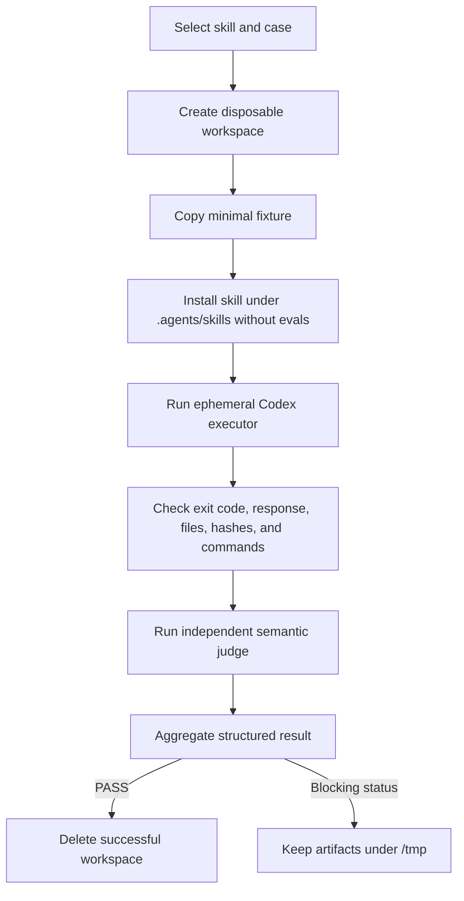

# Evaluating Codex Skills

Skill evaluations, or evals, test what a fresh Codex agent actually does when given a realistic task. They complement structural validation: `quick_validate.py` can prove that a skill is well formed, while an eval can prove that the skill selects the right workflow, changes the right files, preserves protected behavior, and stops at the right safety gate.

This repository provides an evaluation runner in [`develop-skill-with-evals`](develop-skill-with-evals/scripts/run_skill_evals.py). The runner uses disposable workspaces, structured Codex responses, deterministic checks, and an independent semantic judge. The detailed automation rules live in the [evaluation contract](develop-skill-with-evals/references/eval-contract.md), and runner reports follow the [result schema](develop-skill-with-evals/references/eval-result.schema.json).

If you want commands and prompts ready to copy rather than runner internals, start with [Using Skills with Codex CLI](CODEX_CLI.md).

## Mental model

An evaluation has four main actors:

- **Evaluated skill:** the candidate `SKILL.md` and its normal resources.
- **Executor:** a fresh, ephemeral Codex session that receives the task and may edit an isolated fixture.
- **Mechanical checker:** deterministic code that checks exit codes, files, commands, changed paths, and skill integrity.
- **Judge:** a separate Codex session that compares the executor evidence with semantic criteria hidden from the executor.

The baseline is the skill before a behavioral change. The candidate is the proposed skill after the change. A trustworthy behavioral eval fails against the baseline and passes against the candidate.



The executor never receives `case.json`, judge criteria, or other answer key material. The evaluated skill is copied without its `evals/` directory, so the executor cannot discover the oracle through the installation scoped to the repository.

## Requirements

- Python 3.10 or newer;
- Git for workspace snapshots and `git:<revision>` sources;
- an installed and authenticated `codex` CLI;
- an environment where nested `codex exec` processes can access their normal state and write to the disposable workspace.

Run the commands below from the repository root, `/home/renanfranca/.codex/skills`, unless a command says otherwise. Real evals invoke model sessions and therefore consume time and model usage.

## Suite structure

`evals/` is a convention of this repository, not part of the official skill format. It stays outside `references/` so ordinary skill use does not load fixtures or oracles into context.

```text
example-skill/
├── SKILL.md
├── agents/
│   └── openai.yaml
└── evals/
    ├── suite.json
    └── cases/
        └── example-case/
            ├── case.json
            ├── prompt.md
            └── fixture/
                ├── source-file
                └── test-file
```

### `suite.json`

The suite declares its format version and ordered case IDs:

```json
{
  "version": 1,
  "cases": ["example-case", "implicit-trigger-smoke"]
}
```

Each ID must have a matching directory under `evals/cases/`. `run --all` executes cases in this order.

### `prompt.md`

Write the raw request exactly as a user could reasonably submit it. Do not include expected findings, judge criteria, or hints that reveal the intended implementation.

For a normal case, the runner prepends an instruction to use the evaluated `$skill-name`. When `implicit_skill` is `true`, the raw prompt is sent unchanged so the case can test whether the skill is selected without an explicit mention.

### `fixture/`

The fixture is copied into a fresh workspace before every run. Keep it minimal but behaviorally complete: include only the source, tests, and configuration needed to reproduce the scenario.

Never include credentials, personal information, proprietary source, real customer data, full transcripts, or generated model responses. Replace names and values specific to a project with generic equivalents.

### `case.json`

A case combines runner configuration with the expected contract:

```json
{
  "id": "hidden-invocation-state",
  "kind": "behavioral",
  "prompt_file": "prompt.md",
  "implicit_skill": false,
  "mechanical": {
    "expected_exit_code": 0,
    "required_paths": ["report_builder.py", "test_report_builder.py"],
    "forbidden_changed_paths": ["test_report_builder.py", ".agents/skills/**"],
    "commands": [
      {
        "argv": ["python3", "-m", "unittest", "-q"],
        "exit_code": 0
      }
    ]
  },
  "judge": {
    "enabled": true,
    "criteria": [
      "The executor identifies hidden mutable invocation state.",
      "Only production code changes and observable behavior is preserved."
    ],
    "no_action_acceptable": false
  }
}
```

The fields mean:

| Field                                | Meaning                                                                        |
| ------------------------------------ | ------------------------------------------------------------------------------ |
| `id`                                 | Must equal the case directory name.                                            |
| `kind`                               | `behavioral`, `non_behavioral`, or `trigger`; records the evaluation intent.   |
| `prompt_file`                        | Prompt filename relative to the case directory; defaults to `prompt.md`.       |
| `implicit_skill`                     | When `true`, omits the explicit `$skill-name` instruction.                     |
| `mechanical.expected_exit_code`      | Expected exit code from the executor's `codex exec` process.                   |
| `mechanical.required_paths`          | Paths that must exist after execution, relative to the workspace.              |
| `mechanical.forbidden_changed_paths` | `fnmatch` patterns that must not appear in the set of changed paths.           |
| `mechanical.commands`                | Argument arrays run after the agent without a shell, with expected exit codes. |
| `judge.enabled`                      | Enables or disables the independent semantic judgment.                         |
| `judge.criteria`                     | Expected semantic outcomes visible only to the judge.                          |
| `judge.no_action_acceptable`         | Tells the judge that a justified refusal to edit may be correct.               |

The runner always verifies that the copy of the evaluated skill scoped to the repository remained unchanged, even when the case does not list `.agents/skills/**` explicitly.

`kind` documents intent and appears in reports; it does not automatically select a different runner algorithm. The `$develop-skill-with-evals` workflow decides when RED is required and which commands to run.

## What happens during a run

For every case, the runner:

1. Materializes the selected working tree or Git revision skill source.
2. Creates a new operation directory under `/tmp/skill-eval-artifacts` or `--artifacts-dir`.
3. Copies the case fixture into a unique workspace.
4. Copies the evaluated skill to `.agents/skills/<skill-name>`, excluding `evals/`, Python caches, and bytecode.
5. Initializes a Git repository and hashes the initial workspace and installed skill.
6. Runs `codex exec` with an ephemeral session, workspace-write sandbox, disposable working directory, and a JSON output schema.
7. Validates the executor response and all configured mechanical checks.
8. Runs configured verification commands directly, without a shell.
9. Invokes a separate structured judge with the criteria, executor response, and mechanical evidence.
10. Aggregates the case or suite report and writes JSON to standard output.
11. Deletes successful operation workspaces or retains blocking artifacts for diagnosis.

While those phases run, the runner reports progress to standard error. With neither `--progress` nor `--quiet`, progress depends exclusively on `stderr.isatty()`: it is shown when standard error is connected to a terminal and suppressed otherwise. The JSON report remains the only content on standard output.

The executor response must have this shape:

```json
{
  "summary": "What was done or why no action was taken.",
  "classification": "The executor's behavioral or design classification.",
  "evidence": ["Observable validation evidence."],
  "files_changed": ["relative/path.py"]
}
```

The judge returns `PASS`, `FAIL`, or `INCONCLUSIVE` with a rationale and evidence. A case passes only when every mechanical check passes and the judge returns `PASS`.

The overall report groups the operation and its case results:

```json
{
  "operation": "run",
  "status": "PASS",
  "skill": "/absolute/path/to/refactor-design",
  "model": "configured-default",
  "results": [
    {
      "case_id": "hidden-invocation-state",
      "status": "PASS",
      "kind": "behavioral",
      "executor": {},
      "mechanical": {},
      "judge": {},
      "changed_paths": ["report_builder.py"],
      "workspace": null
    }
  ],
  "artifacts": null
}
```

Inspect the nested `executor`, `mechanical`, and `judge` objects for complete evidence. The shortened empty objects above are only an overview of the report hierarchy; the authoritative shape is the linked result schema.

## Result statuses

| Status         | Meaning                                                              | Required response                                             |
| -------------- | -------------------------------------------------------------------- | ------------------------------------------------------------- |
| `PASS`         | Mechanical checks and semantic judgment passed.                      | Continue to the next gate.                                    |
| `FAIL`         | At least one observable contract failed.                             | Inspect artifacts and correct the case or candidate.          |
| `ERROR`        | The runner, manifest, source, or process could not execute reliably. | Fix the environment or configuration before judging behavior. |
| `INCONCLUSIVE` | The judge could not establish whether the criteria were met.         | Treat as blocking and gather better evidence.                 |
| `INVALID_RED`  | The behavioral case passed against the baseline.                     | Stop; strengthen or correct the case before implementation.   |
| `UNSTABLE`     | Repeated normalized outcomes differed.                               | Stop; remove the nondeterminism before promotion.             |

Only `PASS` returns process exit code `0`. Every other status returns `1` and blocks promotion.

Successful reports set `artifacts` and each `workspace` to `null` after cleanup. Blocking reports retain the operation path so the fixture, structured responses, stderr, command output, and `.eval-result.json` can be inspected.

## Command reference

The direct examples below may omit `--progress` because they are intended for a terminal, where the standard error TTY enables progress automatically. Pass `--progress` when a monitoring process such as Codex CLI captures standard error.

### Run one focused case

```bash
python3 develop-skill-with-evals/scripts/run_skill_evals.py run \
  --skill refactor-design \
  --case hidden-invocation-state \
  --source working-tree
```

### Run the complete suite

```bash
python3 develop-skill-with-evals/scripts/run_skill_evals.py run \
  --skill refactor-design \
  --all \
  --source working-tree
```

### Compare baseline RED with candidate GREEN

With an explicit frozen baseline directory:

```bash
python3 develop-skill-with-evals/scripts/run_skill_evals.py verify-change \
  --skill refactor-design \
  --case hidden-invocation-state \
  --baseline /tmp/refactor-design-baseline
```

With the skill as tracked at the current Git revision:

```bash
python3 develop-skill-with-evals/scripts/run_skill_evals.py verify-change \
  --skill refactor-design \
  --case hidden-invocation-state \
  --baseline git:HEAD
```

If `--baseline` is omitted, `verify-change` defaults to `git:HEAD`. To select another tracked revision, use `--baseline git:<revision>`. The `verify-change` subcommand does not accept `--source`. The case definition always comes from the candidate named by `--skill`, so a newly added case does not need to exist in the baseline tree.

### Check stability

```bash
python3 develop-skill-with-evals/scripts/run_skill_evals.py stability \
  --skill refactor-design \
  --case hidden-invocation-state \
  --runs 3 \
  --source working-tree
```

Stability compares overall status, mechanical check names and outcomes, judge verdict, and changed paths relevant to the outcome. It deliberately ignores `.eval-*` files owned by the runner and generated `__pycache__`/`.pyc` files. It does not require identical prose from the model.

### Optional runtime controls

- With neither progress option, output depends exclusively on `stderr.isatty()`: progress is automatic for a TTY and silent for a pipe or redirection.
- `--progress` forces immediate progress on standard error for monitored processes such as Codex CLI runs.
- `--quiet` suppresses progress even in a terminal; it cannot be combined with `--progress`.
- Progress never requests input, approval, or confirmation. TTY detection changes output only, so autonomous runs remain autonomous.
- `--model <model>` uses the same explicit model selection throughout an operation.
- Without `--model`, the report records `CODEX_MODEL` when set or `configured-default`; Codex still resolves its normal configured model.
- Only `run` and `stability` accept `--source`: `--source working-tree` evaluates current files, while `--source git:<revision>` materializes a tracked Git snapshot.
- `verify-change` selects a Git baseline with `--baseline git:<revision>` instead of `--source`.
- Cases are always read from the current skill directory named by `--skill`, even when the installed skill source comes from `git:<revision>`.
- `--artifacts-dir <path>` changes the parent directory used for operation artifacts.
- `--codex-command <path>` replaces the Codex executable, primarily for deterministic runner tests.

## Example: evaluating `refactor-design`

The [`refactor-design` suite](refactor-design/evals/suite.json) contains six complementary cases:

| Case                      | What it proves                                                                                   |
| ------------------------- | ------------------------------------------------------------------------------------------------ |
| `hidden-invocation-state` | Finds mutable state stored for each invocation, refactors only production, and keeps public behavior green.  |
| `cohesive-no-action`      | Leaves a small cohesive implementation unchanged instead of inventing abstractions.              |
| `red-suite-gate`          | Stops before editing when the entry test suite is already red.                                   |
| `no-self-modification`    | Reports reusable learning without modifying the installed skill or its references.               |
| `trigger-selection`       | Selects the skill for design work after GREEN but not missing behavior or initial implementation. |
| `implicit-trigger-smoke`  | Exercises real implicit selection without mentioning `$refactor-design` in the prompt.           |

Start with `hidden-invocation-state`. Its fixture contains a green test through the public interface and a `ReportBuilder` that stores invocation progress on the object. A successful executor identifies the reuse or reentrancy risk, moves progress to local state, changes no tests, and leaves the suite green. The mechanical checker then independently reruns `python3 -m unittest -q`, while the judge evaluates whether the refactor actually removed the demonstrated risk.

After the focused case passes, run its three repetitions and then the full suite:

```bash
python3 develop-skill-with-evals/scripts/run_skill_evals.py stability \
  --skill refactor-design \
  --case hidden-invocation-state \
  --runs 3

python3 develop-skill-with-evals/scripts/run_skill_evals.py run \
  --skill refactor-design \
  --all \
  --source working-tree
```

Do not read success from the executor's prose alone. Check the overall `status`, every mechanical check, the judge verdict, `changed_paths`, the recorded model selection, and whether `artifacts` is `null`.

## Adding evals to another skill

### 1. Classify the change

A behavioral change affects triggering, decisions, actions, stopping conditions, or observable outcomes. A typo, formatting correction, update limited to metadata, or organization change that does not affect behavior does not require an artificial RED; it still requires structural validation and full regression.

When uncertain, treat the change as behavioral.

### 2. Reduce a real example

Start from an observed task or failure, then remove everything that is not necessary to reproduce it. Preserve the public behavior, relevant risk, and validation command. Replace real identifiers and data with generic values.

### 3. Add the case before implementation

Create `case.json`, `prompt.md`, and the minimal `fixture/`, then append the case ID to `evals/suite.json`. Keep assertions observable: files, command results, public outputs, explicit stopping behavior, and semantic evidence. Avoid assertions about private class topology, collaborator call order, or exact prose.

### 4. Demonstrate RED

Freeze the baseline before editing the skill, or use a Git revision. Run the focused case against that source. If it passes, the case does not prove the new behavior; `INVALID_RED` must stop implementation until the case is corrected.

### 5. Implement and prove GREEN

Make the smallest coherent skill change and run the focused case until it passes. Then use `verify-change` to record baseline failure and candidate success under the same operation configuration.

### 6. Prove stability and regression

Run the changed case three times. Any normalized divergence is `UNSTABLE`. When stability passes, run the candidate's complete suite. Any non-`PASS` status blocks promotion.

### 7. Finish structural validation

Run the system skill validator, check `agents/openai.yaml`, inspect the diff for leaked fixtures or transcripts, and run the runner's deterministic tests when its behavior changed:

```bash
PYTHONDONTWRITEBYTECODE=1 python3 -m unittest discover \
  -s develop-skill-with-evals/scripts/tests \
  -v

python3 "${CODEX_HOME:-$HOME/.codex}/skills/.system/skill-creator/scripts/quick_validate.py" \
  ./skill-name

git diff --check
```

Do not commit, push, publish, or promote a candidate unless that separate action is authorized.

## Trigger evaluations

Trigger behavior needs two kinds of evidence:

1. A routing case presents positive and negative requests and checks whether the skill description leads to the correct selection boundaries.
2. An end-to-end smoke case sets `implicit_skill` to `true`, installs a skill copy scoped to the repository, sends a realistic prompt without `$skill-name`, and verifies the resulting behavior.

Keep positive prompts close to the skill's intended use. Negative prompts should be plausible neighboring tasks, such as missing behavior or a red suite for a refactoring skill used after GREEN. Avoid obviously unrelated negatives that cannot reveal excessive triggering.

## Troubleshooting

### `INVALID_RED`

The baseline already satisfies the new case. Confirm that the fixture represents the missing behavior and that the criteria are specific enough to distinguish baseline from candidate. Do not weaken the status policy or continue implementation without a real RED.

### `UNSTABLE`

Inspect each retained `.eval-result.json`. Compare mechanical check outcomes, judge verdicts, and production changed paths. Model wording may vary without causing instability, while different production files or verdicts are significant.

### `INCONCLUSIVE`

Check the judge stderr, authentication, structured response, and available evidence. A judge process failure is not a behavioral failure and must not be converted into `PASS`.

### Read-only access or app server initialization errors

An outer sandbox may prevent a nested Codex client from accessing required state even though the fixture workspace is writable. Run the evaluation from an authorized environment where `codex exec` can initialize normally. Do not bypass safeguards or broaden filesystem access beyond the disposable workspace merely to force a result.

### Missing Git baseline

`git:<revision>` works only when the skill is inside a Git repository and tracked at that revision. Use an explicit frozen directory for a new, untracked skill or scaffold.

### Preserving failure evidence

Use the overall `artifacts` path from the JSON report. Blocking workspaces remain available for diagnosis; successful ones are intentionally removed. Never promote retained transcripts or complete model responses to golden files.

## Design principles

- Test observable behavior and safe decisions, not wording or implementation topology.
- Keep executor input separate from judge criteria and expected answers.
- Combine deterministic checks with semantic judgment; neither replaces the other.
- Treat every status other than `PASS` as a reason to block promotion.
- Use the same model selection and operation configuration for baseline and candidate.
- Keep fixtures minimal, generic, reproducible, and free of confidential data.
- Preserve detailed artifacts only for failures and keep generated responses out of version control.
