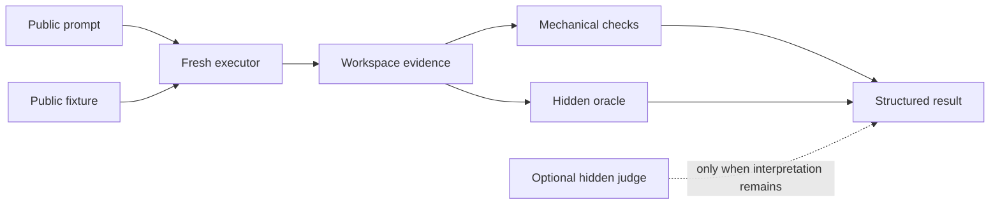

# Evaluating Codex Skills

A skill can be structurally valid and still choose the wrong workflow, edit the wrong files, miss a safety gate, or fail a realistic task. Skill evaluations, or evals, collect evidence about those behaviors. If Codex skills are new to you, read [What is a Codex skill?](README.md#what-is-a-codex-skill) first.

This guide explains how to understand and supervise the evidence produced by [`develop-skill-with-evals`](develop-skill-with-evals/SKILL.md). It begins with a real evaluation, then generalizes the parts and the proof workflow. Use [Using Skills with Codex CLI](CODEX_CLI.md) for copyable recipes. The [evaluation contract](develop-skill-with-evals/references/eval-contract.md), [plan schema](develop-skill-with-evals/references/eval-plan.schema.json), and [result schema](develop-skill-with-evals/references/eval-result.schema.json) remain the normative sources.

## Contents

- [What the automation does](#what-the-automation-does)
- [A complete evaluation](#a-complete-evaluation)
- [Anatomy of an evaluation](#anatomy-of-an-evaluation)
- [Choose the evidence path](#choose-the-evidence-path)
- [Requirements](#requirements)
- [Suite structure](#suite-structure)
- [Coverage as a traceable contract](#coverage-as-a-traceable-contract)
- [The proof cycle](#the-proof-cycle)
- [Choose gates by impact](#choose-gates-by-impact)
- [Plan gates and sessions](#plan-gates-and-sessions)
- [What happens during a run](#what-happens-during-a-run)
- [Result statuses, progress, and artifacts](#result-statuses-progress-and-artifacts)
- [Durable evidence and pricing](#durable-evidence-and-pricing)
- [Command reference](#command-reference)
- [Optional runtime controls](#optional-runtime-controls)
- [Economic runtime policy](#economic-runtime-policy)
- [Example: evaluating `refactor-design`](#example-evaluating-refactor-design)
- [Adding evals to another skill](#adding-evals-to-another-skill)
- [Trigger evaluations](#trigger-evaluations)
- [Troubleshooting](#troubleshooting)
- [Design principles](#design-principles)
- [Structural validation](#structural-validation)

## What the automation does

`develop-skill-with-evals` helps Codex create or revise evaluation cases, preserve the prior skill, plan proportional evidence checkpoints, execute approved runs, and produce auditable reports. The runner isolates each case, protects the evaluated skill, counts planned model sessions, detects changed inputs before execution, and retains failure artifacts when work blocks.

Automation does not decide whether the evaluation represents the maintainer's real intent. A person still needs to supervise:

- whether the case observes the behavior that matters;
- whether its public input avoids revealing the expected answer;
- whether deterministic checks test outcomes rather than implementation details;
- whether the declared impact covers the possible reach of the change;
- whether the planned runtime and session cost are authorized;
- whether every required result supports accepting the change.

The distinction matters: the runner can enforce a declared contract, but it cannot guarantee that the contract is the right one.

## A complete evaluation

The real [`impact-gate-selection`](develop-skill-with-evals/evals/cases/impact-gate-selection/) case tests whether a fresh executor plans the correct evidence for a small runner change. **Impact** classifies which evidence can observe a change and how far its effects may reach. This is a useful first example because an agent must understand and perform the task, while code can verify the complete result.

### 1. The executor receives a prompt

A **prompt** is the public request given to a fresh, ephemeral Codex session called the **executor**. The case's [full prompt](develop-skill-with-evals/evals/cases/impact-gate-selection/prompt.md) says, in part:

> The small runner in `target-skill/scripts/target-runner.py` currently writes its JSON status to standard error. I intend to move that JSON to standard output while preserving the exit code and keeping standard error empty.

It asks the executor to choose the impact, invoke the public planning operation exactly once, save three evidence files, and avoid modifying or evaluating either skill. It does not reveal the expected impact or selected case.

### 2. The runner copies a fixture

A **fixture** is the minimal public starting state copied into an isolated workspace. This case's [`fixture/`](develop-skill-with-evals/evals/cases/impact-gate-selection/fixture/) contains:

- `target-skill`, the proposed source, also called the candidate;
- `target-baseline`, the preserved source before the proposed change, also called the baseline.

The evaluation harness installs `develop-skill-with-evals` separately as the skill under evaluation, including the public planning runner but excluding its `evals/` directory. The executor can inspect the public fixture and installed skill and create evidence in the workspace. It cannot see the case manifest, hidden oracle, or judge criteria.

### 3. The executor produces evidence

The prompt requires:

- `evaluation-plan.json`, containing the plan on standard output;
- `plan-stderr.log`, containing standard error;
- `plan-exit-code.txt`, containing the decimal exit code.

These files make the executor's decision observable without relying on its prose summary.

### 4. Code checks the result

The [case manifest](develop-skill-with-evals/evals/cases/impact-gate-selection/case.json) declares two layers of deterministic evidence. **Mechanical checks** are generic observations configured in `case.json`; here they require the three evidence files, expect executor exit code `0`, and forbid changes to either skill or the installed skill directory.

An **oracle** is a case specific deterministic checker stored under `oracle/`. It runs outside the executor's workspace and is never copied into the installed skill. The [oracle for this case](develop-skill-with-evals/evals/cases/impact-gate-selection/oracle/check_plan.py) reads the saved plan and checks the observable contract:

```python
assert plan["operation"] == "plan"
assert plan["impact"] == "deterministic"
assert plan["selected_cases"] == ["runner-output"]
assert plan["regression_cases"] == []
assert plan["sessions"]["total"] == 0
assert plan["approval_required"] is False
assert plan["execution_blockers"] == []
```

It also checks that planning exited `0` and wrote nothing to standard error.

### 5. The case passes without a judge

A **judge** is a separate Codex session used only when deterministic code cannot interpret the complete semantic contract. This case explicitly disables its judge:

```json
{
  "judge": {
    "enabled": false,
    "criteria": [],
    "no_action_acceptable": false
  }
}
```

The case is still semantic because an executor is needed to understand and perform the open task. It does not need semantic judgment because the oracle can decide the complete result. If the mechanical checks and oracle pass, the case returns `PASS` with one executor session and no judge session.

The visibility and order are:



## Anatomy of an evaluation

These pieces are complementary rather than competing names for the same checker:

| Piece | Purpose | Visible to executor | Evidence | Model sessions |
| --- | --- | --- | --- | --- |
| Prompt | Presents a realistic task. | Yes | Public request and constraints | None by itself |
| Fixture | Provides the minimal starting workspace. | Yes | Public code, tests, configuration, and generic data | None |
| Mechanical checks | Apply reusable observations declared in the manifest. | No manifest access | Exit codes, paths, changes, and command results | None |
| Oracle | Verifies the case specific observable contract. | No | Deterministic assertions over workspace evidence | None |
| Judge | Interprets criteria that code cannot decide completely. | No | Independent `PASS`, `FAIL`, or `INCONCLUSIVE` verdict | One when executed |

The executor never receives `case.json`, judge criteria, or answer key material. The evaluated skill is installed without `evals/`, and the oracle directory remains runner controlled. This separation lets an evaluation test whether the skill can solve the public task instead of merely reproducing a disclosed answer.

## Choose the evidence path

Start with three questions:

1. Does the task need an agent to perform it?
2. Can deterministic code observe the complete contract?
3. If not, what remaining interpretation requires a judge?

A **semantic case** needs an executor to carry out an open task. Its manifest kind is `behavioral`, `non_behavioral`, or `trigger`; omitted `kind` remains compatible with `behavioral`. Use a complete oracle and disable the judge when code can decide the result. Enable a judge only for behavior that still requires semantic interpretation after mechanical and oracle evidence.

A **deterministic case** uses `kind: "deterministic"` when code can perform and verify the complete contract. It has no prompt, executor, or judge and consumes zero model sessions. The runner exposes an immutable skill snapshot through `SKILL_EVAL_SKILL_DIR`, runs direct checks, and verifies that the checker did not alter the snapshot.

Do not label an open task deterministic merely because its final files can be checked. If an agent is necessary to produce those files, the case is semantic even when its verdict is deterministic.

## Requirements

Run the evaluation commands from this repository's root. The runner requires Python 3.10 or newer and Git for snapshots and `git:<revision>` sources. Semantic cases also require an installed and authenticated Codex CLI in an environment where nested `codex exec` processes can read their normal state and write to the disposable workspace. Planning and deterministic cases invoke no model.

Before the first model backed operation, run `codex doctor --json` at the same permission boundary that will launch the runner and require `overallStatus: ok`. An interactive TUI started with `--ask-for-approval on-request` does not automatically elevate a noninteractive subprocess. When `CODEX_HOME` is read only or network access is unavailable, request external approval for the exact complete runner command. Preserve the runner's internal `workspace-write` sandbox for every executor and judge. Do not use `danger-full-access`, bypass approval, or move authentication state into `/tmp`.

## Suite structure

`evals/` is a repository convention, not part of the official skill format. It stays outside `references/` so ordinary skill use does not load test fixtures or hidden evidence into context.

```text
example-skill/
├── SKILL.md
└── evals/
    ├── suite.json
    └── cases/
        ├── semantic-example/
        │   ├── case.json
        │   ├── prompt.md
        │   ├── fixture/
        │   └── oracle/
        │       └── check_contract.py
        └── deterministic-example/
            ├── case.json
            └── fixture/
                └── check_behavior.py
```

`suite.json` declares a format version and ordered case IDs. The order controls `run --all` and the remaining regression cases for cross cutting validation:

```json
{
  "version": 1,
  "cases": ["semantic-example", "deterministic-example"]
}
```

Each `case.json` combines runner configuration with the expected contract. The fields most useful during supervision are:

| Field | Meaning |
| --- | --- |
| `id` | Must match the case directory. |
| `kind` | Records semantic intent or selects the deterministic path. |
| `prompt_file` | Names the semantic prompt; defaults to `prompt.md`. |
| `implicit_skill` | Omits the explicit `$skill-name` instruction to test implicit selection. |
| `mechanical.expected_exit_code` | Expected executor process exit code. |
| `mechanical.required_paths` | Workspace paths that must exist. |
| `mechanical.forbidden_changed_paths` | Patterns that must not appear among changed paths. |
| `mechanical.commands` | Direct argument arrays and their expected exit codes. |
| `oracle.commands` | Hidden checker argument arrays; `{oracle_dir}` resolves to the protected oracle directory. |
| `judge.enabled` | Enables independent semantic judgment. |
| `judge.criteria` | Expected semantic outcomes visible only to the judge. |

See the [evaluation contract](develop-skill-with-evals/references/eval-contract.md) and schemas for the complete field rules. Keep fixtures minimal and behaviorally complete. Never include credentials, personal information, proprietary source, customer data, full transcripts, generated model responses, or hidden answers.

## Coverage as a traceable contract

A traceable coverage manifest connects requirements to the observations intended to protect them. This section uses `refactor-design` as the running example: its manifest makes suite scope and maintenance obligations inspectable, but the declaration is not evidence that a semantic case executed or passed.

| Layer | General meaning | In `refactor-design` | What it does not prove |
| --- | --- | --- | --- |
| Normative traceability | Every governed instruction is declared and mapped to at least one distinct case dimension and evidence type. | The [`refactor-design` manifest](refactor-design/evals/coverage.json) fingerprints `SKILL.md` and both rubric references, then maps their contracts to cases, evidence, guarantee levels, and limitations. | That the mapped `refactor-design` cases ran, passed, or will generalize to every future task. |
| Mechanical integrity | Declared fingerprints, suite membership, case IDs, dimensions, evidence compatibility, and structural invariants satisfy a deterministic checker. | The [`refactor-design` coverage contract](refactor-design/evals/cases/coverage-contract/case.json) checks those relationships and rejects deliberately stale or inconsistent copies. | That `refactor-design` made correct contextual judgments, such as whether a risk is concrete or a refactor is proportionate. |
| Semantic behavior | When applicable gates execute and pass, the evaluated scenario satisfied its public checks, oracle, and judge criteria for those runs. | For `refactor-design`, actual semantic evidence comes from structured runner statuses such as the [archived six case report](evaluation-reports/refactor-design/operations/20260727T144730.399249Z-24a76a532c0b/report.md), not from the coverage manifest. | That unexecuted or modified `refactor-design` cases passed, or that results are universal across models, prompts, repositories, technologies, or future runs. |
| Rubric sampling | Representative signals, risks, false positives, and technologies are mapped without requiring one case for every rubric item. | `refactor-design` groups every rubric section into representative families and distinct case dimensions in its manifest; selected semantic cases still have to run. | Permission to skip selected `refactor-design` suite cases or a claim that every contextual classification is correct. |

`complete` and `partial` in `coverage.json` are declared coverage levels, not execution statuses. Representative coverage removes the requirement for one case per rubric item, but it does not authorize skipping cases selected by the applicable suite gates. Semantic qualification requires those gates to execute and pass.

For `refactor-design`, the result is specific: its normative map is declaratively complete and mechanically validated, while its new or modified semantic cases are not qualified. The [dated `refactor-design` state](#example-evaluating-refactor-design) records the detailed evidence and pending gates.

Case count remains a poor proxy for coverage. In `refactor-design`, overlap is useful only when cases declare different observation dimensions, such as explicit invocation, implicit selection, a stop condition, or Java technology. Duplicate scenarios with the same contract and dimension add cost without improving traceability.

## The proof cycle

A **baseline** is the preserved skill before the change. A **candidate** is the proposed version. For behavioral work, create the case before implementing the change so the same contract evaluates both sources.

A **gate** is a required evidence checkpoint. Promotion follows this sequence:

1. Preserve independent baseline and candidate sources.
2. Reduce a real task or failure to a minimal case.
3. Classify the change's impact.
4. Build a side effect free plan and approve its runtime and session maximum.
5. Demonstrate **RED**: each affected case must fail on the baseline for the expected reason.
6. Demonstrate **GREEN**: each affected case must pass on the candidate three times with stable normalized outcomes.
7. Run regression proportional to the declared impact.
8. Inspect statuses, evidence, usage, and retained artifacts before promotion.

RED proves that the case distinguishes the missing behavior rather than accepting both versions. Three GREEN runs provide bounded stability evidence; they do not prove that model output is deterministic. Regression asks whether the candidate damaged behavior outside the directly affected cases.

**Promotion** is the integrated workflow that requires valid RED, three stable GREEN results, and proportional regression. A **diagnostic** is a one pass observation used to understand a defect. A diagnostic can return `PASS`, but it is never promotion eligible.

## Choose gates by impact

Ask which evidence can observe the proposed change, then how far its effects can reach:

| Impact | Use when | Required gates |
| --- | --- | --- |
| `static` | Documentation, comments, formatting, or display text cannot affect selection or behavior. | Structural validation only. |
| `deterministic` | Code can observe the complete runner, schema, serialization, exit code, or artifact contract. | Baseline once and candidate three times with deterministic cases. |
| `scoped` | Every affected semantic case can be named confidently. | Affected baseline RED once and candidate GREEN three times. |
| `cross-cutting` | Selection, safety, central workflow, shared guidance, or reach cannot be bounded confidently. | Affected RED and GREEN 1, every remaining case once, then affected GREEN 2 and 3. |

Classify the diff, not merely the file type or desired cost. A shared Markdown reference can be cross cutting, while runner code can be deterministic when direct checks cover it completely. Treat uncertain reach as cross cutting. Underclassification to reduce session cost is a workflow error.

## Plan gates and sessions

`plan` validates manifests, selects ordered gates, resolves runtime declarations, reports `economic_runtime`, and calculates maximum model sessions without creating workspaces, ledgers, artifacts, or model calls. The recommendation is informative and never replaces explicit runtime parameters:

```bash
python3 develop-skill-with-evals/scripts/run_skill_evals.py plan \
  --skill ./candidate-skill \
  --baseline /tmp/baseline-skill \
  --impact scoped \
  --case changed-behavior \
  --model <executor-model> \
  --reasoning-effort <effort>
```

A **fingerprint** is a hash that binds approved inputs and execution choices. It protects against running changed material under stale approval. Review:

- affected and regression case selection;
- baseline and candidate execution counts;
- executor, judge, and total session maximums;
- runtime values and their sources;
- economic recommendations, match state, and reasons;
- approval requirements, blockers, and warnings;
- manifest, case, source, runtime, and evaluation fingerprints.

Case fingerprints cover manifests, prompts, fixtures, and oracles; source fingerprints cover baseline and candidate; runtime and evaluation fingerprints bind execution choices, economic guidance, and selection. The runner recomputes them before execution so a changed input cannot silently use stale approval.

A model session is one executor or judge invocation. Semantic cases always plan an executor session and add a judge session when enabled. Deterministic cases add none. The plan counts maximum sessions, not tokens, duration, or price.

A **campaign** is a related set of diagnostic and promotion operations. A campaign ledger uses locking and conservative reservations to track actual consumption against one explicitly approved cumulative session limit. Use it when several operations need shared cost supervision. Obtain model session cost authorization separately from external approval of the exact runner command; neither approval implies the other.

The default operation limit is eight model sessions. Model backed promotion requires explicit executor model and reasoning effort; a required judge may use explicit values or inherit the complete executor runtime. Missing runtime or insufficient operation or campaign approval appears under `execution_blockers` and prevents execution.

## What happens during a run

### Common preparation

The runner materializes the selected source, creates a unique operation directory, copies the fixture to a new workspace, and makes an immutable evaluated skill snapshot that excludes `evals/`, Python caches, and bytecode. It hashes the fixture and skill state before execution.

### Semantic path

For a semantic case, the runner:

1. installs the skill under `.agents/skills/<skill-name>`;
2. invokes an ephemeral `codex exec --json` in the isolated workspace;
3. validates the structured executor response and mechanical checks;
4. runs direct verification commands without a shell;
5. runs hidden oracle commands outside the executor's view;
6. invokes a separate judge only when enabled and prior evidence permits it.

A judged case passes only when every mechanical and oracle check passes and the judge returns `PASS`. A complete oracle can produce `PASS` without a judge.

### Deterministic path

For a deterministic case, the runner skips the executor and judge, exposes the immutable skill snapshot to direct checks, and verifies its hash after execution. It creates no artificial executor response.

### Integrated promotion path

`validate-change` rebuilds the promotion plan. Before any workspace or session, it rejects missing runtime, insufficient budgets, or fingerprint and count mismatches. Once approved, it runs affected baseline cases, affected candidate GREEN 1, remaining cross cutting regressions, and affected GREEN 2 and 3.

A baseline `PASS` becomes `INVALID_RED`. Divergent normalized candidate outcomes become `UNSTABLE`. There are no automatic retries after blocking evidence.

## Result statuses, progress, and artifacts

Every status other than `PASS` blocks promotion:

| Status | Meaning | Required response |
| --- | --- | --- |
| `PASS` | Every required check and judgment passed. | Continue to the next gate. |
| `FAIL` | An observable contract failed. | Inspect evidence and correct the case or candidate. |
| `ERROR` | The runner, manifest, source, or process could not execute reliably. | Fix the environment or configuration. |
| `INCONCLUSIVE` | A judge could not establish the contract. | Improve the evidence or criteria. |
| `INVALID_RED` | An affected case passed on the baseline. | Correct the case before implementation. |
| `UNSTABLE` | Repeated normalized outcomes differed. | Remove the source of instability. |

Executed evaluations return exit code `0` only for `PASS` and `1` for blocking results. A cost refusal returns `2`, prints the plan with `approval_required: true`, and creates no artifacts. `plan` itself returns `0`, including when it reports blockers.

Standard output contains only structured plan or report JSON. Progress is written to standard error, follows terminal detection by default, can be forced with `--progress`, and can be suppressed with `--quiet`.

Successful workspaces are removed and their `artifacts` and `workspace` fields become `null`. Blocking workspaces are retained. Use the top level `artifacts` path to inspect structured responses, standard error, command output, changed files, and `.eval-result.json` files. Retained responses are diagnostic evidence, not fixtures or golden files.

Normalized stability compares status, mechanical outcomes, judge verdict, and outcome relevant changed paths. It ignores runner harness files, Python caches, bytecode, and variations in model prose.

## Durable evidence and pricing

The repository archive configuration can automatically persist operations that consume real model sessions:

```text
evaluation-reports/<skill-name>/operations/<operation-id>/report.json
evaluation-reports/<skill-name>/operations/<operation-id>/report.md
```

`report.json` is the canonical evidence and carries a SHA-256 digest over its canonical content. `report.md` is a deterministic projection regenerated from the JSON. Reports record provenance, fingerprints, runtime, planned and actual sessions, timestamps, duration, normalized token telemetry, mechanical facts, oracle and judge outcomes, bounded changed files and diff evidence, truncations, and optional pricing.

Reports exclude raw JSONL, complete transcripts, private reasoning, credentials, hidden oracle contents, installed skill contents, Git metadata, harness files, Python caches, and bytecode. A persistence failure after session use is blocking and retains diagnostic artifacts.

Pricing uses an explicit dated API reference. It is an estimate, never an observed ChatGPT charge, and records `actual_charge: false`. Unknown token fields remain `null`, reasoning output is not priced twice, and request scoped long context multipliers are not applied to incompatible aggregate telemetry. When an exact estimate is unsupported, the report retains a labeled base rate reference instead of inventing a value.

Archive rebuilding, validation, report rendering, pricing examples, and model comparison recipes are in [Using Skills with Codex CLI](CODEX_CLI.md#persist-evidence-with-dated-pricing). The normative persistence and pricing rules are in the [evaluation contract](develop-skill-with-evals/references/eval-contract.md#durable-evidence-reports).

## Command reference

Use one side effect free `plan` for supervision, then one integrated operation for the intended purpose:

- `probe-change` runs one diagnostic pass and is never promotion eligible;
- `validate-change` enforces promotion gates, stability, regression, runtime declarations, and budgets;
- `run`, `verify-change`, and `stability` remain focused exploratory or compatibility operations.

The shortest promotion path is:

```bash
python3 develop-skill-with-evals/scripts/run_skill_evals.py validate-change \
  --skill ./candidate-skill \
  --baseline /tmp/baseline-skill \
  --impact scoped \
  --case changed-behavior \
  --model <executor-model> \
  --reasoning-effort <effort> \
  --progress
```

Do not run `validate-change` for `static` work; execute the structural gates shown by its plan. For complete commands, campaign options, explicit report destinations, archive maintenance, and compatibility operations, use the [CLI cookbook](CODEX_CLI.md#validate-the-planned-change).

## Optional runtime controls

Choose controls according to the decision being supervised:

| Need | Controls |
| --- | --- |
| Declare auditable executor runtime | `--model`, `--reasoning-effort` |
| Override inherited judge runtime | `--judge-model`, `--judge-reasoning-effort` |
| Select proportional evidence | `--impact`, repeatable `--case`, `--workflow` |
| Authorize operation sessions | `--approved-model-sessions` |
| Authorize a cumulative campaign | `--campaign-ledger`, `--approved-cumulative-model-sessions` |
| Control monitoring output | `--progress`, `--quiet` |
| Select evidence persistence | `--report-dir`, `--pricing-file`, `--no-report` |

`plan` accepts runtime controls because it invokes no model and can show the future command before approval. The runner does not read global `config.toml`; promotion quality requires explicit runtime declarations. See [Run skill evaluations](CODEX_CLI.md#run-skill-evaluations) for command scope, source selection, defaults, and compatibility behavior.

## Economic runtime policy

Keep cost proportional to the evidence:

| Change or role | Policy |
| --- | --- |
| `static` or fully `deterministic` | Use structural checks, tests, schemas, oracles, fakes, replay, and deterministic comparison. Real model sessions: zero. |
| `scoped` semantic change with complete oracle and judge disabled | Recommend `gpt-5.6-luna` with `medium` reasoning effort as the explicit executor after a side effect free plan. Every selected case must declare `oracle.commands`. With one eligible case, the normal promotion path is one RED plus three GREEN executor sessions. |
| Semantic judge | Prefer a complete deterministic oracle. When interpretation is unavoidable, recommend `gpt-5.6-terra` with `medium` reasoning effort as judge under an explicit maximum and select the executor manually. |
| `cross-cutting` change or incomplete oracle | Select the executor manually from justified task evidence. Do not infer Luna from the impact label alone. |
| Indispensable complex promotion | Use `gpt-5.6-sol` with `medium` reasoning effort only when complexity or representative diagnostic evidence justifies it. Keep Terra `medium` as judge only where semantic judgment remains necessary. |

Do not retry an unchanged evaluation with a larger model after blocking evidence. Escalation needs a diagnosis, a material correction or new hypothesis, a refreshed plan, and approval for any changed maximum. Model and reasoning choices must remain explicit so reports can attribute evidence and cost correctly. `economic_runtime` reports the recommendation, its reasons, and whether it matches a complete explicit declaration. A mismatch adds a warning, never a blocker, and preserves the explicit command.

## Example: evaluating `refactor-design`

The [`refactor-design` suite](refactor-design/evals/suite.json) is a broader example after the minimal `impact-gate-selection` case. Its [`coverage.json`](refactor-design/evals/coverage.json) binds source fingerprints, normative contracts, rubric families, case dimensions, evidence types, guarantee levels, and explicit limitations. The zero session `coverage-contract` case checks those relationships and proves that deliberately stale or inconsistent copies are rejected.

The manifest records declared normative traceability while the semantic cases remain representative samples. The following state was observed on 2026-07-27:

| Evidence | Observed state | Durable basis and limitation |
| --- | --- | --- |
| [`coverage-contract`](refactor-design/evals/cases/coverage-contract/case.json) | `PASS`: one RED and three GREEN runs, zero model sessions. | Deterministic contract evidence only. It does not qualify semantic behavior. |
| Six earlier semantic cases | `PASS` in the [archived report](evaluation-reports/refactor-design/operations/20260727T144730.399249Z-24a76a532c0b/report.md). | Covers the earlier versions of `hidden-invocation-state`, `cohesive-no-action`, `red-suite-gate`, `no-self-modification`, `trigger-selection`, and `implicit-trigger-smoke`, not their later modifications. |
| Eight new or modified semantic cases in the [current suite](refactor-design/evals/suite.json) | Diagnostic not completed. | No completed diagnostic or promotion result qualifies these versions as `PASS`. |
| Strengthened [`hidden-invocation-state`](refactor-design/evals/cases/hidden-invocation-state/case.json) negative control | `INVALID_RED`. | The baseline solved the scenario, so the control did not distinguish the candidate. No durable report was archived for this observation. |
| [Java fixture](refactor-design/evals/cases/java-hexagonal-mapping/fixture/compile_and_test.py) | Local compilation and test `PASS`. | Proves the fixture is executable; it is not a semantic executor or judge result. |
| [`java-hexagonal-mapping`](refactor-design/evals/cases/java-hexagonal-mapping/case.json) | Not executed semantically. | Its mapping and local fixture checks do not establish a case `PASS`. |
| Semantic promotion | Not performed. | The suite has no integrated RED, three GREEN, and applicable regression evidence for the new or modified semantic cases. |

If a change affects only one bounded behavior, plan that case as `scoped`. If shared guidance, safety, or selection may affect several cases, use `cross-cutting` so the remaining suite runs once between affected GREEN 1 and GREEN 2. The [CLI cookbook](CODEX_CLI.md#plan-proportional-gates-first) shows the corresponding command. Do not infer success from executor prose; inspect the structured status and all required evidence.

## Adding evals to another skill

`develop-skill-with-evals` can create or revise the suite, cases, fixtures, oracles, plans, and promotion runs. A maintainer should review the following decisions rather than manually reproduce every runner step:

1. **Intent:** Does the case represent a real user journey or failure?
2. **Separation:** Does the prompt stay realistic and free of hidden answers?
3. **Observability:** Do checks prove public outcomes without coupling to private topology or exact prose?
4. **Evidence path:** Does the task require an executor, and can an oracle replace a judge?
5. **RED:** Does the preserved baseline fail for the intended reason?
6. **Impact:** Are affected and regression cases proportional to the possible reach?
7. **Runtime and cost:** Do the plan, fingerprints, session maximum, and campaign approval match the intended execution?
8. **Promotion:** Are all affected GREEN results stable and every required regression `PASS`?

For deterministic behavior, create a manifest and direct checker without a prompt or model configuration. For semantic behavior, create `case.json`, a realistic `prompt.md`, and the minimal public fixture. Put complete code observable contracts under `oracle/`; add a judge only for interpretation code cannot cover. Append the case ID to `suite.json`.

Never create an artificial RED for a static change. Do not commit, push, publish, or promote unless that separate action is authorized.

## Trigger evaluations

Trigger behavior is cross cutting because it changes when a skill enters a workflow. It needs:

1. a routing case with plausible positive and neighboring negative requests;
2. an end to end smoke case with `implicit_skill: true`, a realistic prompt that omits `$skill-name`, and observable resulting behavior.

Negative prompts should test a genuine boundary, such as missing behavior versus design review after GREEN. Obviously unrelated negatives do not reveal excessive selection.

## Troubleshooting

### Approval required

Inspect `execution_blockers`, runtime sources, session totals, campaign projection, case selection, fingerprints, and warnings. Supply missing runtime or obtain explicit approval for the correct maximum. Do not lower impact merely to fit a limit. Cost authorization and external shell approval are independent.

### Invalid deterministic manifest

The case contains semantic fields, enables a judge, or lacks a direct observation. Remove those fields only when code genuinely covers the complete contract; otherwise use a semantic kind.

### `INVALID_RED`

The baseline already satisfies the case. Confirm that the fixture reproduces missing behavior and that the contract distinguishes baseline from candidate.

### `UNSTABLE`

Compare retained `.eval-result.json` files. Mechanical outcomes, judge verdicts, and production changed paths must be stable; model wording need not be identical.

### `INCONCLUSIVE`

Inspect judge standard error, authentication, structured output, criteria, and available evidence. A judge process failure is not a behavioral failure and cannot become `PASS`.

### Missing Git baseline

`git:<revision>` requires a tracked skill in a Git repository. Use an explicit frozen directory for a new or untracked skill. `plan` and integrated workflows require baseline directory paths.

### Read only or initialization errors

An outer sandbox may prevent a nested Codex client from accessing `CODEX_HOME` or the network even when the fixture workspace is writable. Run `codex doctor --json` at the same permission boundary intended for the runner and require `overallStatus: ok`. Starting the TUI with `--ask-for-approval on-request` does not automatically elevate the noninteractive runner subprocess.

If the preflight fails for filesystem or network access, request external approval for the exact complete runner command. Keep each executor and judge in the runner's internal `workspace-write` sandbox. Do not use `danger-full-access`, bypass approval, or move credentials into `/tmp`. Approve model session cost separately because shell approval and cost authorization do not imply one another.

### Preserving failure evidence

Use the report's top level `artifacts` path. Do not copy complete transcripts or generated responses into version control.

## Design principles

- Test observable behavior and safe decisions, not wording or implementation topology.
- Define each public input separately from hidden expected evidence.
- Use deterministic checks when they cover the complete contract and semantic judgment only when they do not.
- Choose evidence that can observe the change, then apply gates proportional to impact.
- Treat uncertain reach as cross cutting and every non `PASS` status as blocking.
- Use the same declared executor and judge runtime for baseline and candidate.
- Treat planned sessions as a maximum and actual sessions, tokens, duration, and campaign consumption as separate observations.
- Use fingerprints for auditability without claiming deterministic model output.
- Do not retry unchanged blocking evaluations.
- Keep fixtures minimal, generic, reproducible, and free of confidential data.
- Retain detailed artifacts only for failures and keep generated responses out of version control.
- Use a fresh agent for forward validation before promoting significant skill behavior.

## Structural validation

For a skill documentation or metadata change:

```bash
python3 .system/skill-creator/scripts/quick_validate.py ./skill-name
git diff --check
```

When runner behavior or schemas change, also run the deterministic unit tests and validate both schemas. See [Safety and troubleshooting](CODEX_CLI.md#safety-and-troubleshooting) for the surrounding operational guidance.

Do not commit, push, publish, or promote unless that separate action is authorized.
