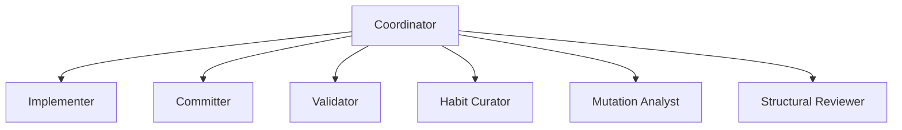

# DSH independente do Codex

O ambiente usa a Web UI oficial do DeepSeek Harness. O serviço, as sessões e os
workflows continuam funcionando quando o Codex é fechado. O Windows precisa
permanecer ligado, acordado e conectado.

## Abrir neste computador

No PowerShell:

```powershell
wsl -d Ubuntu-Seed4J --exec /home/renanfranca/.local/bin/dsh-env open --local
```

Abra o endereço completo impresso no Vivaldi. Ele autentica esse navegador e
redireciona para `http://127.0.0.1:3080/`. A mensagem `dsh web authentication
required` significa que falta essa autenticação. Cada navegador mantém seu
próprio cookie; um endereço antigo com token pode expirar após reiniciar o DSH.

## Abrir no Android

Conecte o aplicativo Tailscale à mesma conta/rede. No PowerShell, obtenha o
endereço de autenticação remoto:

```powershell
wsl -d Ubuntu-Seed4J --exec /home/renanfranca/.local/bin/dsh-env open
```

Abra o endereço completo no navegador do Android. Depois da primeira
autenticação, use <https://renan-dsh.taileb74b9.ts.net/>. O acesso passa pelo
Tailscale Serve privado; o DSH escuta apenas em `127.0.0.1:3080`.

## Planejar e implementar

Escolha um workspace na barra lateral e crie uma sessão. Envie `/plan`, descreva
a mudança e aprove o plano pelo painel oficial. A aprovação encerra o turno de
planejamento. Para implementar, envie na mesma sessão:

```text
/implement-approved-plan-deepseek
Execute o plano aprovado com slug minha-mudanca, branch minha-mudanca e base main.
```

A sessão atual se torna Coordinator. São criadas seis sessões comuns,
persistentes e visíveis na barra lateral do mesmo workspace:



Os títulos começam com o slug. Se a barra lateral mostrar apenas cinco sessões,
toque em “Show 2 more sessions” para revelar as demais. Você pode abrir e conversar com qualquer uma;
mudanças no checkout são autorizadas pelo Coordinator por assignments e leases.
Os follow-ups reutilizam os mesmos IDs. O ledger e os relatórios ficam em
`.agent/tmp/` no checkout. A entrega deixa o PR aberto e acompanha a CI.

A conexão e o modelo padrão são administrados pelo DSH. O plugin aplica os
esforços por função definidos em `roleReasoningEfforts`, registrando a seleção
aceita para cada sessão e preservando o padrão global do Web. A skill descreve
o workflow sem exigir um provedor ou modelo específico. Full Access usa
`danger-full-access` e aprovação `never`, com os privilégios do usuário Linux
`renanfranca`. O limite de saída por chamada é 16384 tokens.

## Comandos e recuperação

No terminal do Ubuntu-Seed4J:

```bash
dsh-env start
dsh-env stop
dsh-env restart
dsh-env status
dsh-env doctor
dsh-env workspaces
dsh-env sessions
dsh-env resume SESSION_ID
```

No PowerShell, use o prefixo
`wsl -d Ubuntu-Seed4J --exec /home/renanfranca/.local/bin/dsh-env` seguido da
operação, por exemplo `status`.

Reinicie preferencialmente com as sessões ociosas. Depois, abra o Coordinator
original e peça `workflow_resume` para reconciliar os mesmos seis especialistas,
o branch, os processos e os assignments. Uma interrupção mantém o lease até
diagnóstico; não há repetição automática de commit, push ou PR.

## Chave e documentação

`DEEPSEEK_API_KEY` é carregada no ambiente do processo a partir do arquivo
privado `/home/renanfranca/.loadenv/deepseek.env`. O inicializador usa `loadenv deepseek`. Para substituí-la, edite esse arquivo localmente, mantenha permissão
`600` e execute `dsh-env restart`. Não coloque o valor em mensagens ou arquivos
versionados.

- [Instalação, configuração, acesso e limitações](references/environment.md)
- [Workflow e fronteiras de autoridade](references/workflow.md)
- [APIs oficiais e orquestração](references/orchestration.md)
- [Ledger e transições](references/ledger.md)
- [Recuperação](references/recovery.md)
- [Entrega GitHub e CI](references/github-delivery.md)

A execução real de validação usa o workspace privado
`/home/renanfranca/projects/dsh-workflow-smoke-test`. A skill original
`implement-approved-plan` foi preservada.
